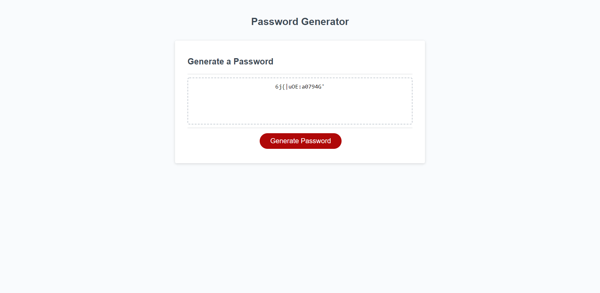

# Secure Password Generator

## Table of Contents:
* [Purpose](#purpose)
* [Featuers](#features)
* [Website](#website)
* [Contribution](#contribution)

## Purpose
* Allows a user to input a list of paramaters in order to generate their own secure password

## Features
* User can select how long they want their password to be between the numbers of 8 and 128
* User can select if they want to include the following character types or not: 
  * Upper Case letters
  * Lower Case Letters
  * Special Characters
  * Numbers
* Once user has inputed these paramater a password will be generated for them that they can copy and paste.

## Website

[Deployed Password Generator](https://ajcuddeback.github.io/password-generator)

## Contribution
Starting code was provided by [UCF's Coding Bootcamp](https://github.com/coding-boot-camp/friendly-parakeet).
